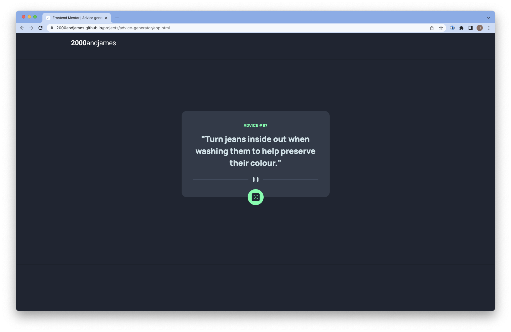

# Frontend Mentor - Advice generator app solution

This is a solution to the [Advice generator app challenge on Frontend Mentor](https://www.frontendmentor.io/challenges/advice-generator-app-QdUG-13db). Frontend Mentor challenges help you improve your coding skills by building realistic projects.

## Table of contents

- [Overview](#overview)
  - [The challenge](#the-challenge)
  - [Screenshot](#screenshot)
  - [Links](#links)
- [My process](#my-process)
  - [Built with](#built-with)
- [Author](#author)

**Note: Delete this note and update the table of contents based on what sections you keep.**

## Overview

### The challenge

Users should be able to: click the button and generate a new piece of advice.

- 

### Screenshot

### Links

- Solution URL: [URL here](https://github.com/2000andjames/2000andjames.github.io/tree/main/projects/advice-generator)
- Live Site URL: [URL here](https://2000andjames.github.io/projects/advice-generator/app.html)

## My process

### Built with

- Semantic HTML5 markup
- CSS custom properties
- Bootstrap CSS
- Vanilla Javascript

## Author

- Website - [2000andjames](https://2000andjames.github.io/)
- Frontend Mentor - [@2000andjames](https://www.frontendmentor.io/profile/2000andjames)