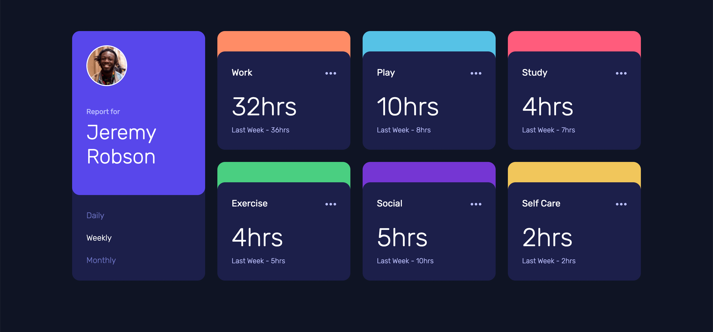

# Frontend Mentor - Time tracking dashboard solution

This is a solution to the [Time tracking dashboard challenge on Frontend Mentor](https://www.frontendmentor.io/challenges/time-tracking-dashboard-UIQ7167Jw). Frontend Mentor challenges help you improve your coding skills by building realistic projects. 

## Table of contents

- [Overview](#overview)
  - [The challenge](#the-challenge)
  - [Screenshot](#screenshot)
  - [Links](#links)
- [My process](#my-process)
  - [Built with](#built-with)
  - [What I learned](#what-i-learned)
- [Author](#author)

## Overview

### The challenge

Users should be able to:

- View the optimal layout for the site depending on their device's screen size
- See hover states for all interactive elements on the page
- Switch between viewing Daily, Weekly, and Monthly stats

### Screenshot



### Links

- Solution URL: [URL here](https://github.com/2000andjames/2000andjames.github.io/tree/main/projects/time-tracker)
- Live Site URL: [URL here](https://2000andjames.github.io/projects/time-tracker/app.html)

## My process

### Built with

- Semantic HTML5 markup
- CSS custom properties
- Flexbox
- CSS Grid
- Boostrap CSS
- jQuery

### What I learned

Getting more practice using flex to position and layout elements

```css
.some-element {
    display: flex;
    align-items: center;
    justify-content: space-around;
}
```


## Author

- Website - [2000andjames](https://2000andjames.github.io/)
- Frontend Mentor - [@2000andjames](https://www.frontendmentor.io/profile/2000andjames)
